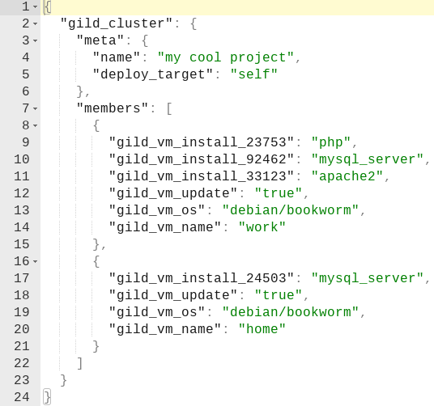

# gild

work in progress

extremely alpha

feedback welcome!

example usage:
```import gild/cluster
import gild/os/debian
import gild/types.{type VM}
import gild/vm

pub fn project(members: List(VM)) -> String {
  cluster.new()
  |> cluster.name("my sweet project")
  |> cluster.export()
}

pub fn home() -> VM {
  vm.new()
  |> vm.name("home")
  |> vm.os(debian.version("12"))
  |> vm.update()
  |> vm.install("mysql_server")
  |> vm.return()
}

pub fn work() -> VM {
  vm.new()
  |> vm.name("work")
  |> vm.os(debian.version("12"))
  |> vm.update()
  |> vm.install("apache2")
  |> vm.install("mysql_server php")
  |> vm.return()
}

pub fn main() {
  let c =
    cluster.new()
    |> cluster.name("from africa with love")
    |> cluster.member(home())
    |> cluster.member(work())
    |> cluster.export()
  //io.debug(c)
}
```

output:



this library is used to help create visualizations inside the [linkha.sh](http://linkha.sh) online playground and will be used inside a cli utility to make the declarative configuration come to life
